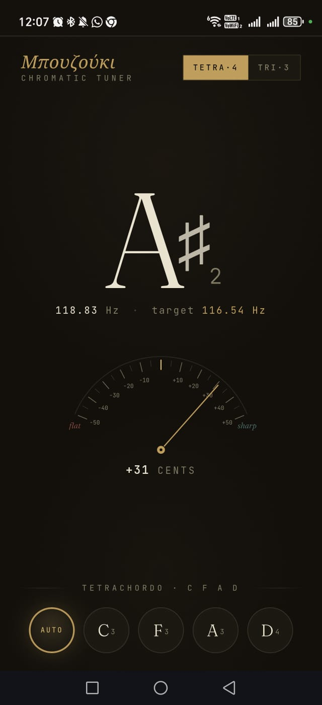

# Bouzouki Tuner

A free, ad-free chromatic tuner for the Greek bouzouki, built as a progressive web app. No account, no tracking, no install from a store — just open the page in your phone's browser and tune.

Supports both common Greek bouzouki tunings:

- **Tetrachordo (4-course)** — C₃ F₃ A₃ D₄
- **Trichordo (3-course)** — D₃ A₃ D₄

## Use it

Open the live version on your phone:

**→ https://sonapsav.github.io/bouzouki-tuner/**

*(you may replace the URL above with your actual GitHub Pages address once forked/published, otherwise you may use it as-is)*

Allow microphone access when prompted, then pluck a string. That's it.

### Add to your home screen

For the proper app experience (full-screen, own icon, launches like a native app):

- **Android (Chrome):** three-dot menu → *Add to Home screen* (or *Install app* if offered)
- **iOS (Safari):** share button → *Add to Home Screen*

## How to use it

**AUTO mode** (default). The tuner listens and tells you what note you're playing plus how far off you are from the nearest semitone. When a detected note happens to match one of your bouzouki strings in the current tuning, that string's pill gets a subtle gold highlight.

**Manual mode.** Tap any string pill (C₃, F₃, A₃, D₄) to lock the tuner onto that specific target. Useful when a string has drifted more than a semitone — in AUTO mode the tuner would confidently identify it as the wrong note, which is useless when you're trying to get back to the right one.

**Reading the meter.**

- Needle **left of centre** = flat, tighten the string
- Needle **right of centre** = sharp, loosen the string
- Within **±5 cents** the display turns gold and a short haptic buzz confirms you're in tune
- The number below the arc is the exact deviation in cents (1/100th of a semitone)

Switch between Tetra and Tri tunings with the toggle in the top right.

## How it works, briefly

Pitch detection uses **ACF2+ autocorrelation** (Chris Wilson's algorithm) with parabolic interpolation for sub-sample accuracy, over a 2048-sample window at whatever sample rate the browser provides (usually 44.1 or 48 kHz). This means it tracks the fundamental frequency reliably even when the bouzouki's sympathetic strings are ringing out and adding overtones.

The microphone is configured with echo cancellation, automatic gain control, and noise suppression all **disabled** — these are standard Web Audio defaults for voice calls but they mangle the signal for pitch tracking.

All processing is local to your phone. No audio ever leaves the device.

## Running your own copy

Fork this repo, enable GitHub Pages (Settings → Pages → Source: main branch, root folder), and your copy is live in about a minute at `https://YOUR-USERNAME.github.io/YOUR-REPO-NAME/`.

The entire app is four files:

- `index.html` — the app itself (markup, styles, and pitch-detection logic all in one file)
- `manifest.webmanifest` — PWA metadata
- `icon-192.png`, `icon-512.png` — home-screen icons

To modify the tuner, edit `index.html` directly. To change the icon, replace the two PNGs with your own at the same dimensions and filenames.

### Requirements for the microphone to work

The Web Audio microphone API (`getUserMedia`) requires an **HTTPS** connection. GitHub Pages provides HTTPS by default, so it works out of the box there. Opening the HTML file directly from your filesystem (`file://`) will **not** work for microphone access — you'll get permission errors.

## Browser support

Tested and working:

- Chrome / Edge on Android (recommended)
- Safari on iOS 14.5+
- Chrome, Firefox, Safari on desktop

Requires a browser with Web Audio API support, which means effectively anything from the last five years.

## License

MIT — see [LICENSE](LICENSE). Do whatever you want with it.

## Attribution

Made with love by Panos Vasilopoulos (sonapsav)
